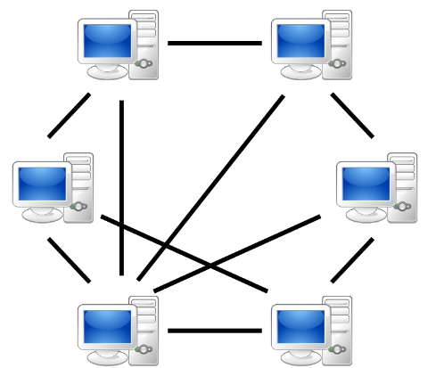
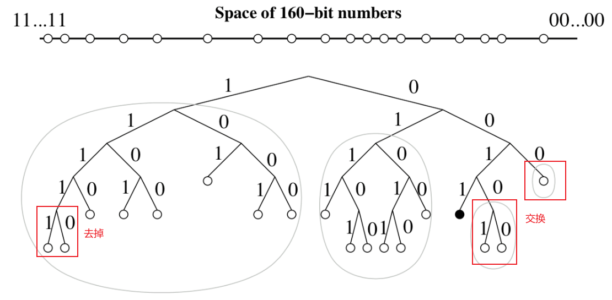
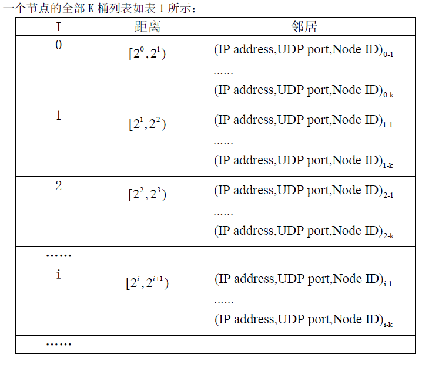
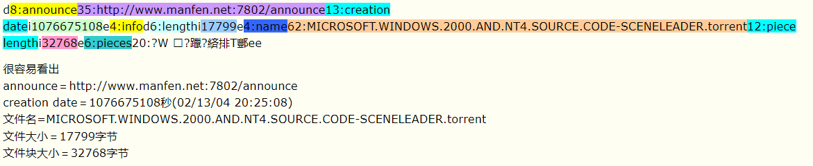
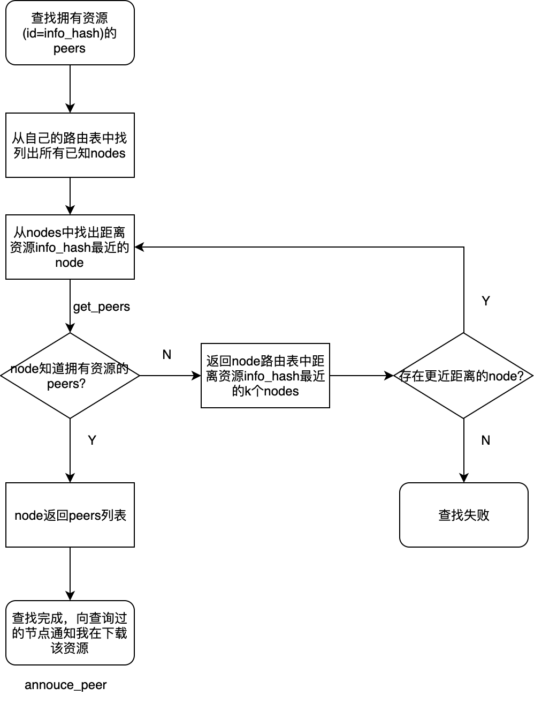

# P2P分布式文件共享


​	对等式网络（peer-to-peer， 简称P2P），又称点对点技术，是无中心服务器、依靠用户群（peers）交换信息的互联网体系，它的作用在于，减低以往网路传输中的节点，以降低资料遗失的风险。与有中心服务器的中央网络系统不同，对等网络的每个用户端既是一个节点，也有服务器的功能，任何一个节点无法直接找到其他节点，必须依靠其用户群进行信息交流。



## Gossip

​	Gossip 协议也被称为“流言协议”。它是一种分布式算法，用于在节点之间传递信息。当一个种子节点有状态需要`更新`到网络中的其他节点时，它会随机的选择周围几个节点散播消息，收到消息的节点也会重复该过程，直至最终网络中所有的节点都收到了消息。

这个过程可能需要一定的时间，由于不能保证某个时刻所有节点都收到消息，但是理论上最终所有节点都会收到消息，因此它是一个最终一致性协议。


1. Gossip 是周期性的散播消息，把周期限定为 1 秒
2. 被感染节点随机选择 k 个邻接节点（fan-out）散播消息，这里把 fan-out 设置为 3，每次最多往 3 个节点散播
3. 每次散播消息都选择尚未发送过的节点进行散播
4. 收到消息的节点不再往发送节点散播，比如 A -> B，那么 B 进行散播的时候，不再发给 A


缺点：

1. 消息延迟
2. 消息冗余

## DHT 分布式哈希表

​	Kademlia协议（以下简称Kad）是一种分布式哈希表（DHT）技术，不过和其他 DHT 实现技术比较，如
Chord、CAN、Pastry 等，Kad 通过独特的以`异或`算法（XOR）为距离度量基础，建立了一种全新的 DHT 拓扑结构，相比于其他算法，大大提高了路由查询速度。

### 节点状态

​	在 Kad 网络中，所有节点都被当作一颗二叉树的叶子。对于任意一个节点，都可以把这颗二叉树分解为一系列连续的，不包含自己的子树。最高层的子树，由整颗树不包含自己的树的另一半组成；下一层子树由剩下部分不包含自己的一半组成；依此类推，直到分割完整颗树。

以下是节点 `0011` 的子树划分：



> 虚线包含的部分就是各子树，由上到下各层的前缀分别为`1`，`01`，`000`，`0010`

### 节点间距离

​	Kad 网络中每个节点都有一个 `160bit` 的 ID 值作为标志符，Key也是一个 `160bit` 的标志符，每一个加入 Kad 网络的节点都会 160bit 的 key 空间被分配一个节点ID（node ID）值（可以认为 ID 是随机产生的），那么 `<key, value>`对的数据就存放在ID 值`最接近` key 值的
节点上。

判断两个节点x,y 的距离远近是基于数学上的`异或`的二进制运算，`d(x,y) = x⊕y`，既对应位相同时结果为0，不同时结果为1。

```
d(x, x) = 0
d(x, y) > 0, if x ≠ y
V x, y : d(x, y) = d(y, x)
d(x, y) + d(y, z) >= d(x, z)
```

### K桶

​	对每一个0<=i<=160，每个节点都保存有一些和自己距离范围在区间 `[2i , 2i+1)` 内的一些节点信息，这些信息由一些〈IP address, UDP port, Node ID〉数据列表构成（UDP 协议交换信息）。每一个列表都称之为一个 K 桶，都有不超过 k 个数据。在 BitTorrent 的实现中，取值为`k=8`。



由于每个K桶覆盖距离的范围呈指数关系增长，这就形成了离自己近的节点的信息多，离自己远的节点的信息少，从而可以保证路由查询过程是收敛。经过证明，对于一个有 N 个节点的 Kad 网络，最多只需要经过 `logN` 步查询，就可以准确定位到目标节点。

### K桶更新策略

**被动更新**

​	当一个 Kad 节点 A 接收到另外一个节点 B 的消息（`FIND_NODE`、`FIND_VALUE`），Kad 节点会更新 B 到对应的 _k_-bucket 中：

1. 计算自己和发送者的距离：`d(x,y) = x⊕y`，注意：x 和 y 是 ID 值
2. 通过距离 d 选择对应的 K 桶进行更新操作

- B 已经在 _k_-bucket 中了 => 那就将 B 移动到 _k_-bucket 尾部（_k_-bucket 中的位置越后面，表示这个节点越近看到过）；
- B 没有在 _k_-bucket 中：
  - _k_-bucket 未满 => 那就将 B 插入到 _k_-bucket 尾部；
  - _k_-bucket 已满 => 节点 A PING 这个 _k_-bucket 中**存活时间最久**的节点C（头部节点），来决定如何处理：
    - ping 失败了，将失败的节点淘汰掉，把 B 插入到 _k_-bucket 尾部;
    - ping 成功了，将这个节点 C 插入到 _k_-bucket 尾部，同时丢弃节点 B。

_k_-bucket 采用的是 `least-recently seen` 淘汰策略，也就是假设存活时间最长的节点越不容易掉线。另一个 _k_-bucket 的优势在于一定程度上抵抗了 DoS 攻击，无法通过大量节点同时加入节点的方式，从而刷新节点的路由表的方式来泛洪集群，因为 Kad 网络只会在旧节点离开系统的时候才加入新的节点。

---
**主动更新**

​	任何节点都可以发起 `FIND_NODE`（查询节点）的请求，从而刷新 K-桶中的节点信息。

为了防止 K 桶老化，所有在一定时间之内无更新操作的K 桶，都会分别从自己的 K 桶中随机选择一些节点执行 `RPC_PING` 操作。


### 消息类型

Kademlia 包含了四种 RPC 消息类型：

- **PING**: 探测节点是否存活
- **STORE**: 保存 Key-Value 数据到节点上，注意这里没有 DELETE 协议（因为数据是自动老化的）
- **FIND_NODE**: 查找离给定 ID 最近的 _k_ 个节点（可能位于一个 _k_-bucket，或者在几个 _k_-bucket 上）
- **FIND_VALUE**: 与 **FIND_NODE** 类似，返回 〈IP address, UDP port, Node ID〉，不过如果 RPC 的接收节点上有给定的 ID 值的 Key-Value 数据（收到同一个 key 的 `STORE` 操作），则返回保存的数据内容。

#### FIND_NODE 节点查找

>计算到 t 的距离：d(x, y) = x ⊕ y

>从 x 的第 `[log d]` 个 K 桶中取出 α 个节点的信息，如果这个 K 桶中的信息少于 α 个，则从附近多个桶中选择距离最接近 d 的总共 α 个节点。在 BitTorrent 实现中，取值为α＝3。

1. 先从离自己最近的非空 _k_-bucket 中选出 $\alpha$ 个初始节点；
2. 向这 $\alpha$ 个节点并行发送异步的 **FIND_NODE** RPC 请求；
3. 节点上接收到 **FIND_NODE** RPC 的回复之后，从 reply 中学习到较近的节点列表，再向这些节点发送 **FIND_NODE** RPC ；
4. 如果节点没有响应，那就可以认为这个节点失败了，更新自己的 _k_-bucket；
5. 如果 **FIND_NODE** 响应的节点比已经找到的节点更远的话，那就需要重新发送 **FIND_NODE** 给 _k_ 个没有查找过的最近的节点。
6. 整个查找过程直到最近的 _k_ 个节点全部响应了为止。

#### FIND_VALUE 数据查找

​	当节点 x 要查询 <key,value> 对时，和查找节点的操作类似，x选择 k 个 ID 值最接近 key 值的节点，执行 `FIND_VALUE` 操作，并对每一个返回的新节点重复执行 `FIND_VALUE` 操作，直到某个节点返回 value 值。一旦操作成功执行后，则 <key,value> 对数据会缓存在没有返回 value 值的最接近的节点上。这样下一次查询相同的 key 时就会更加快速的得到结果。

#### STORE 数据存放

1. 发起者首先定位 k 个 ID 值最接近 key 的节点；
2. 发起者对这 k 个节点发起 `STORE` 操作
3. 执行 `STORE` 操作的 k 个节点每小时重发布自己所有的 <key,value> 对数据。（Key 的老化时间为 24 小时）

为了补偿节点离开网络的影响，Kad 每小时重放一次 Key-Value 对，但是这就引入了另一个问题，对于一个保存在 _k_ 个节点上的 Key 来说，一共会有 $k * (k-1)$ 个 **STORE** 消息。Kad 中的优化方案就是，一个节点收到了一个 Key-Vaule **STORE** 消息，那么他认为其它节点也收到了这个消息，在接下来的一个小时他就不再往外发布同一个Key。

规定在任何时候，当节点 w 发现新节点 u 比 w 上的某些 <key,value>对数据更接近，则 w 把这些 <key,value> 对数据复制到节点 u 上，但是并不会从节点 w 上删除。

### 节点加入与离开

​	如果节点 v 要想加入 Kad 网络，必须知道 Kad 网络的一个节点，比如 w。节点 v 首先把 w 插入自己适当的 K 桶中，然后对自己的节点 ID 执行一次 `FIND_NODE` 操作，然后根据接收到的信息更新自己的 K 桶内容。同时 Kad 网络上的其它节点也就将 v 加入到了自己的 K 桶中。

节点离开 Kad 网络不需要发布任何信息。其他节点在维护 K 桶的过程会把该节点从 K 桶移除。

## Bittorrent协议

​	BitTorrent（简称BT）是一个文件分发协议，每个下载者在下载的同时不断向其他下载者上传已下载的数据，充分利用了用户的上载带宽。通过一定的策略保证上传速度越快，下载速度也越快。

BitTorrent协议是架构于 TCP/IP 协议之上的一个 P2P 文件传输协议，处于 TCP/IP 结构的应用层。根据 BitTorrent 协议，文件发布者会根据要发布的文件生成提供一个`.torrent`文件，即种子文件，也简称为“种子”。

`.torrent`文件本质上是文本文件，包含 `Tracker` 信息和`文件`信息两部分。Tracker信息主要是 BT 下载中需要用到的 Tracker 服务器的地址和针对 Tracker 服务器的设置，文件信息是根据对目标文件的计算生成的，计算结果根据 BitTorrent 协议内的 B 编码规则进行编码。它的主要原理是需要把提供下载的文件`虚拟`分成大小相等的块，块大小必须为2k的整数次方（由于是虚拟分块，硬盘上并不产生各个块文件），并把每个块的索引信息和 Hash 验证码写入种子文件（.torrent）中。所以，种子文件（.torrent）就是被下载文件的“索引”。



**NOTE**: 每一个文件块计算出 20 字节 SHA1 值

### Tracker

收集下载者信息的服务器，并将此信息提供给其他下载者，使下载者们相互连接起来，传输数据。

### 下载过程

​	下载时，BT客户端首先解析 `.torrent` 文件得到 Tracker 地址，然后连接 Tracker 服务器。Tracker服务器回应下载者的请求，提供下载者其他下载者（包括发布者）的IP。下载者再连接其他下载者，根据`.torrent` 文件，两者分别对方告知自己已经有的块，然后交换对方没有的数据。

​	下载者每得到一个块，需要算出下载块的 Hash 验证码与 `.torrent` 文件中的对比，如果一样则说明块正确，不一样则需要重新下载这个块。

## MagNet协议

Magnet不需要 Tracker 服务器，也不需要 `.torrent文件`，仅需要一串字符就可以进行文件下载。

 一个BT的客户端拥有2个角色：
- 作为 BT 下载的节点，实现 Bittorrent 协议来进行上传和下载资源，我们称为Peer。
- 作为 DHT 网络中的一员，实现 DHT 协议，保存一部分其他 Peer 的地址信息，作为Tracker，我们称为Node。



### Bittorrent with DHT


## Dragonfly V2

### Trainer
[PR#2546](https://github.com/dragonflyoss/Dragonfly2/pull/2546)

## 问题
- [x] 节点如何加入 P2P 网络？
- [x] 数据如何分片？
- [ ] 节点如何上传/下载文件？
- [ ] 节点如何加速下载？
- [ ] 安全问题？

## 参考资料
1. [Kademlia笔记](https://segmentfault.com/a/1190000000351815)
2. [[eMule] Kademlia 原理介绍](https://groups.google.com/g/ironward/c/Nd9Mmx1JMJY)
3. [易懂分布式 | Kademlia算法](https://www.jianshu.com/p/f2c31e632f1d)
4. [分布式散列表协议 —— Kademlia 详解](https://www.addesp.com/archives/5338)
5. [BitTorrent 伙伴（Peer）协议详解](https://www.addesp.com/archives/5271)
6. [BitTorrent Tracker 协议详解](https://www.addesp.com/archives/5313)
7. [聊聊分布式散列表（DHT）的原理 — — 以 Kademlia（Kad） 和 Chord 为例](https://program-think.medium.com/%E8%81%8A%E8%81%8A%E5%88%86%E5%B8%83%E5%BC%8F%E6%95%A3%E5%88%97%E8%A1%A8-dht-%E7%9A%84%E5%8E%9F%E7%90%86-%E4%BB%A5-kademlia-kad-%E5%92%8C-chord-%E4%B8%BA%E4%BE%8B-8e648d853288)
8. [A Brief History of P2P Content Distribution, in 10 Major Steps](https://medium.com/paratii/a-brief-history-of-p2p-content-distribution-in-10-major-steps-6d6733d25122)
9. [github p2p-kademlia](https://github.com/jsvisa/Hitchhikers-guide-to-the-Ethereum/blob/master/60.p2p-kademlia.md)
10. [【一步一步教你写BT种子嗅探器】DHT篇](https://github.com/shiyanhui/dht/wiki/%E3%80%90%E4%B8%80%E6%AD%A5%E4%B8%80%E6%AD%A5%E6%95%99%E4%BD%A0%E5%86%99BT%E7%A7%8D%E5%AD%90%E5%97%85%E6%8E%A2%E5%99%A8%E3%80%91DHT%E7%AF%87)
11. [Kademlia: the P2P System Behind Ethereum and BitTorrent Networks](https://medium.com/@ievstrygul/kademlia-the-p2p-system-behind-ethereum-and-bittorrent-networks-a3d8f539f114)
12. [【P2P网络】BitTorrent的DHT协议(译自官方版本)](https://blog.csdn.net/xxxxxx91116/article/details/7970815)
13. [使用WireShark进行磁力链接协议分析](https://www.aneasystone.com/archives/2015/05/analyze-magnet-protocol-using-wireshark.html)
14. [BitTorrent协议分析](https://www.zhaoyingze.com/bittorrent%E5%8D%8F%E8%AE%AE%E5%88%86%E6%9E%90/)